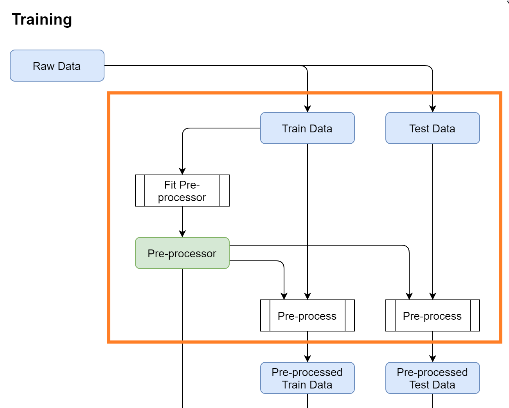

====================================================
How to train a model with the MyAutoML cookiecutter?
====================================================

:Author: Ernst Bolle
:Last update: 2021-05-18

Introduction
============

In this tutorial we will show you step-by-step how to train a binary classification model with the help of MyAutoML.
There are quite a few steps we need to take, but if you are already familiar with MyAutoML you may head directly to the
step of interest.

* :ref:`Get a local copy of MyAutoML`
* :ref:`Create and populate a new virtual environment`
* :ref:`Configure the setup`
    * data
    * pre-processing
    * estimator & hyperparameters
    * config.yml
* Run the train script
* Evaluate
* More estimators
* Wrapping up

Get a local copy of MyAutoML
----------------------------

Before we start you might wonder: what is Cookiecutter? Cookiecutter is a CLI tool that allows you to easily create a
project structure including important folders, scripts and documents. It is a way to save time if you find yourself
creating and copy-pasting the same folder and scripts over time. A brief introduction can be found `on medium`_. You can
install Cookiecutter with pip.

.. _on medium: https://medium.com/worldsensing-techblog/project-templates-and-cookiecutter-6d8f99a06374#:~:text=Cookiecutter%20is%20a%20CLI%20tool,as%20well%20as%20file%20content.

.. code:: bash

   pip install cookiecutter

If you already have Cookiecutter installed make sure it is up to date since we will use the --directory option.
More information on the installation of Cookiecutter can be found `here <https://cookiecutter.readthedocs.io/en/1.7.2/installation.html>`_.
Once installed, move to the folder where you want to store MyAutoML and paste the following command.

.. code:: bash

   cookiecutter https://github.com/myautoml/myautoml.git --directory="cookiecutter/binary_classifier"

You will be prompted with a few questions regarding the project, this is a convenient feature of Cookiecutter to
customize the new project to your wishes. When finished you are ready to create a new virtual environment.

Create and populate a new virtual environment
---------------------------------------------

A virtual environment allows you to install and use specific versions of Python and packages specifically for one project.
This prevents cumbersome version conflicts when you run multiple projects from the same environment over time.
More information on virtual environments can be found on `real python`_.

.. _real python: https://realpython.com/python-virtual-environments-a-primer/

Move to the /scripts folder and enter the following commands from your terminal.

.. code:: bash

    conda env create -f environment.yml
    conda activate <name_of_your_environment>

Configure the setup
-------------------

MyAutoML comes with templated Python scripts and a config file, all meant to write as little custom code as possible,
and to keep focused on what makes your project stand out: the data.

data
^^^^

For this tutorial we are going to use the `Bank Marketing Data Set <https://archive.ics.uci.edu/ml/datasets/Bank+Marketing>`_
from the UCI Machine learning repository. The official reference is:

    [Moro et al., 2014] S. Moro, P. Cortez and P. Rita. A Data-Driven Approach to Predict the Success of Bank Telemarketing.
    Decision Support Systems, Elsevier, 62:22-31, June 2014

This dataset holds a typical marketing classification task, where we are interested in predicting whether a customer
will respond to a marketing campaign yes or no. The independent variables are a mix of demographics (age), customer
specific data (balance), and behavioural data (response to previous campaigns).

To transform this dataset to a actual training data we need to adjust the ``scripts/data.py`` module, specifically the
``load_training_data`` function. Make sure to correctly refer to the bank marketing dataset.

.. code:: python

    import pandas as pd
    from pathlib import Path
    from sklearn.model_selection import train_test_split

    def load_training_data():
        df_path = Path('..') / 'data' / 'bank' / 'bank-full.csv'
        df = pd.read_csv(df_path, sep=';', usecols=['age', 'default', 'balance', 'housing',
                                                    'loan', 'poutcome', 'y'])
        x = df.drop(labels='y', axis=1)
        y = df['y'].astype('category').cat.codes.astype('bool')

        x_train, x_test, y_train, y_test = train_test_split(x, y,
                                                            stratify=y,
                                                            test_size=0.2,
                                                            random_state=123)

        return x_train, y_train

Now that we have the training data, we need to shape it so it can be used for modeling.

pre-processing
^^^^^^^^^^^^^^

For demonstration purposes we will only use 6 independent variables plus the dependent variable of the original dataset.

.. csv-table:: dataset preview
   :file: ./tables/preview.csv
   :header-rows: 1

There are 3 pre-processing steps we need to take:

- Select the columns of interest
- Scale the numerical variables
- Create numeric dummy variables for the categorical variables

It is possible to perform these pre-processing steps with customer Python functions, but we opt to choose for a scikit-learn
pipeline. There are a number of advantages of using a pipeline, such as being able to ``fit`` the transformations on
the training data, and to apply these on the test data. This is an important step in building models but easily missed.
The `official documentation`_ of MyAutoML illustrates this nicely.

.. _official documentation: https://myautoml.readthedocs.io/en/latest/getting_started/ml_process.html

The pre-processor can be set in ``scripts/model.py``, where an example pipeline is already shown in the `get_preprocessor`
function. We will overwrite the example with the following code.

.. code:: python

    def get_preprocessor():
        numeric_transformer = Pipeline(steps=[
            ('scaler', StandardScaler())])

        categorical_transformer = Pipeline(steps=[
            ('onehot', OneHotEncoder(handle_unknown='ignore'))])

        preprocessor = ColumnTransformer(transformers=[
            ('num', numeric_transformer, selector(pattern="age|balance")),
            ('cat', categorical_transformer, selector(pattern="default|housing|loan|poutcome"))]
        )

        return preprocessor

If any of this code is unfamiliar to you we can highly recommend watching these short `videos`_ on calmcode or read the
`official pipeline documentation`_. Next, we need to choose an estimator.

.. _videos: https://calmcode.io/scikit-learn/pipeline.html
.. _official pipeline documentation: https://scikit-learn.org/stable/modules/generated/sklearn.pipeline.Pipeline.html

estimator & hyperparameters
^^^^^^^^^^^^^^^^^^^^^^^^^^^

To be able to build a full model pipeline, MyAutoML also uses scikit-learn for its estimators. For this tutorial we will
use logistic regression, but you can use any estimator from scikit-learn that is suited for binary classification.

To setup the estimator in ``scripts/model.py`` we need to retrieve a few things, which are all available in the
`official LogisticRegression documentation`_.

.. _official LogisticRegression documentation: https://scikit-learn.org/stable/modules/generated/sklearn.linear_model.LogisticRegression.html

- module name: sklearn.linear_model
- class name: LogisticRegression
- hyperparameters: C, class_weight

This information can directly be used to set the ``get_estimator`` and ``get_params`` functions.

.. code:: python

    from sklearn.linear_model import LogisticRegression

    def get_estimator(**params):
        estimator = LogisticRegression(**params)
        estimator_tags = {'module': 'sklearn.linear_model',
                          'class': 'LogisticRegression'}

        return estimator, estimator_tags

    def get_params():
        estimator_params = {}
        search_space = {
            'C': hp.quniform('C', 0, 1, 0.0001),
            'class_weight': hp.choice('class_weight', [None, 'balanced'])
        }

        return estimator_params, search_space

Note that it is important that the keys from the ``search_space`` dictionary exactly match the names of the hyperparameters.
The ``hp.`` methods help to create a hyperparameter space which can be efficiently searched with ``hyperopt`` when
training the model.

config.yml
^^^^^^^^^^

